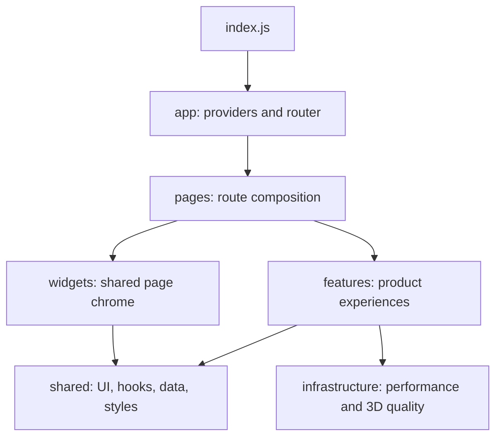

# Genesis

An interactive React experience built with Three.js, Framer Motion, GSAP, Lenis, and an adaptive 3D asset pipeline.

## Project structure



Source code lives in `frontend/src`. Routes are `/`, `/gallery`, `/events`, `/team`, and `/admin-events`.

## Event Management Admin Panel

### Access & Security Details

- **Admin URL**: `/admin-events` (e.g., `genesishacks.in/admin-events`)
- **Default Credentials**:
  - **Username**: `admin` (or `admin@genesishacks.in`)
  - **Password**: `genesis2026`

### Key Features Implemented

1. **Authentication System (`adminAuthService.js`)**:
   - Secure login form with password validation, remember-session options, and active session protection.
   - Prevents unauthorized access to the event management interface.

2. **Categorization (Upcoming vs. Past Events)**:
   - Admin panel features a 1-Click Status Switcher (`Upcoming Event` vs. `Past Event`).
   - When an event status is set to `Upcoming`, the website automatically moves it into the **Upcoming Events** section on the homepage and events gallery.
   - When set to `Past`, it is automatically categorized under the **Past Events Archive**.

3. **Event Detail Management (`AdminEventModal.jsx`)**:
   - **Thumbnail Image Upload**: Drag-and-drop or browse image files directly from your computer (auto-converted to Base64 preview & storage), paste direct image URLs, or choose from high-resolution preset covers.
   - **Event Information**: Title, Subtitle / Tagline, Category Track (`Hackathon`, `Workshop`, `Meetup`, `Bootcamp`, `Ideathon`), Mode (`In-Person`, `Virtual`, `Hybrid`).
   - **Dates & Venue**: Event Date, Timing, City, Full Address / Venue Name.
   - **Registration & External Links**: Luma / Registration URL, Media Gallery link.
   - **Metrics & Partners**: Attendees/Capacity, Sponsors list, Prize Pool amount, Host details, Event Description / Blurb.

4. **Real-time Website Synchronization (`eventService.js`)**:
   - Updates made in the admin panel are saved locally and broadcasted in real time.
   - Both `EventsPage.jsx` and the homepage `Events.jsx` automatically reflect any additions, edits, or status changes instantly.

## Start locally

```bash
cd frontend
npm install
npm start
```

Open `http://localhost:3000`.

## Commands

```bash
npm start                 # development server
npm test                  # test runner
npm run build             # production build
npm run optimize:models   # generate adaptive GLB tiers
npm run optimize:models:ktx2
```

## Documentation

Start with [`docs/README.md`](docs/README.md). It links to architecture, contribution workflow, code standards, performance rules, and UI/animation/3D practices.
