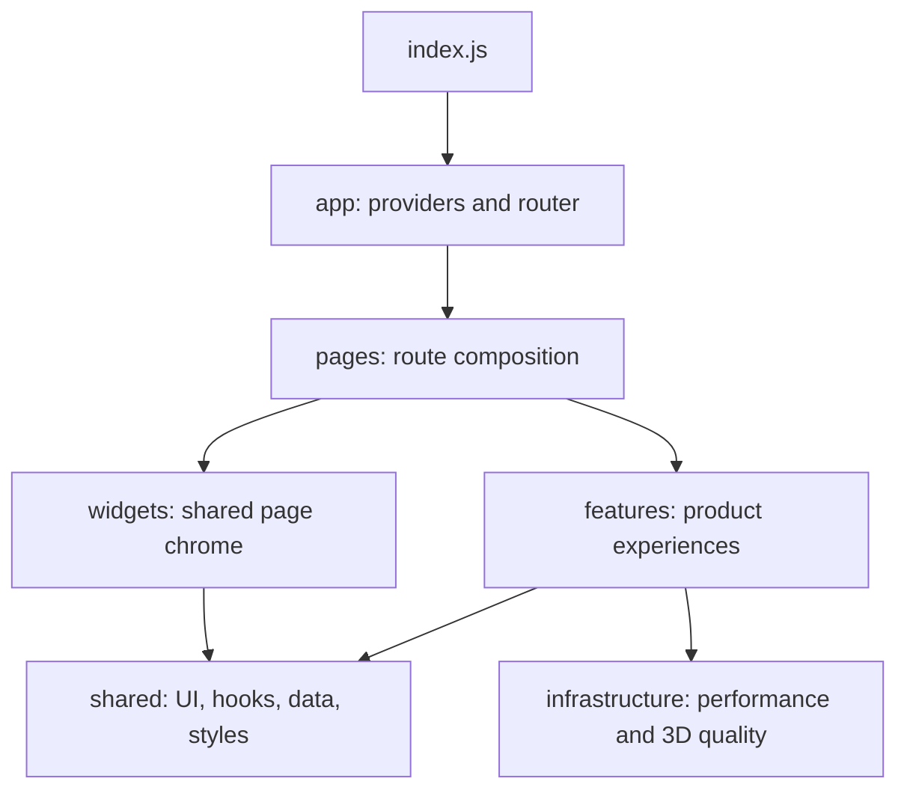

# Genesis

An interactive React experience built with Three.js, Framer Motion, GSAP, Lenis, and an adaptive 3D asset pipeline.

## Project structure



Source code lives in `frontend/src`. Routes are `/`, `/gallery`, and `/events`.

## Start locally

```bash
cd frontend
npm install
npm start
```

Open `http://localhost:3000`.

## Commands

```bash
npm start                 # development server
npm test                  # test runner
npm run build             # production build
npm run optimize:models   # generate adaptive GLB tiers
npm run optimize:models:ktx2
```

## Documentation

Start with [`docs/README.md`](docs/README.md). It links to architecture, contribution workflow, code standards, performance rules, and UI/animation/3D practices.
