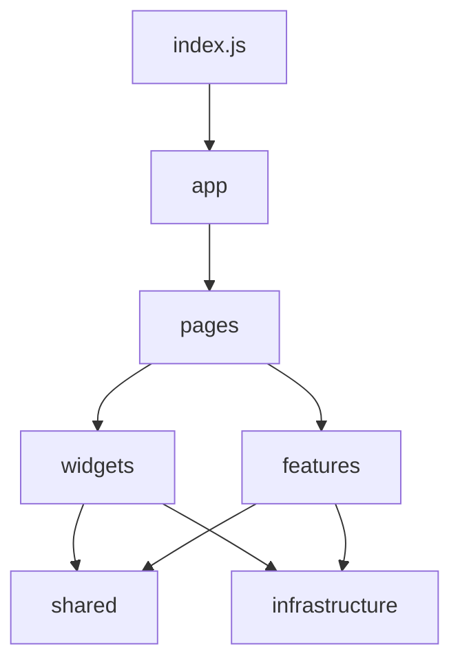

# Frontend architecture

The frontend uses a pragmatic layered architecture. Dependencies flow downward; lower layers must not reach back into higher layers.

## Layer responsibilities

### `app/`

Application wiring only:

- global providers;
- router configuration;
- route loading fallbacks.

Do not place page markup or domain behavior here.

### `pages/`

Route-level composition:

- `home/`;
- `gallery/`;
- `events/`.

Pages may assemble widgets and features. Route modules are lazy-loaded in `app/router/AppRouter.jsx`.

### `widgets/`

Reusable page-level chrome such as the navbar, footer, intro, cursor, marquee, and chapter rail. Widgets may import from `shared` and `infrastructure`, but not from pages.

### `features/`

Self-contained experiences such as hero, about, event showcase, contact, and galleries. Keep feature-specific components, shaders, and behavior together.

### `shared/`

Generic modules with no domain ownership:

- `ui/` — reusable primitives;
- `hooks/` — generic lifecycle hooks;
- `lib/` — framework-neutral helpers;
- `data/` — shared static data;
- `styles/` — global design tokens and shell styles;
- `constants/` — stable IDs and constants.

`shared` must never import from pages, widgets, or features.

### `infrastructure/`

Low-level technical systems. The adaptive quality stack lives in `infrastructure/performance`, including device/network/GPU detection, model loading, FPS monitoring, and rendering presets.

## Import aliases

| Alias | Layer |
|---|---|
| `@app` | `src/app` |
| `@pages` | `src/pages` |
| `@widgets` | `src/widgets` |
| `@features` | `src/features` |
| `@shared` | `src/shared` |
| `@infra` | `src/infrastructure` |

Use a feature's `index.js` for its public API. Deep imports are acceptable only for a genuinely private implementation used inside the same feature.

## Adding a route

1. Add a folder under `pages/`.
2. Keep the page focused on composition.
3. Add a lazy import and route in `app/router/AppRouter.jsx`.
4. Confirm direct URL refresh works through `historyApiFallback`.
5. Test mobile, keyboard navigation, reduced motion, and production build.

## Adding a feature

Create `features/<feature-name>/` with the component, local helpers, styles, and assets it owns. Export the intended public API from `index.js`; do not expose every internal file.

## Known debt

`pages/events/EventsPage.jsx` currently mixes GSAP, Lenis, Three.js, embedded CSS, and UI state. Treat it as temporary debt, not a template for new pages. Prefer splitting future work into page composition plus smaller feature modules.
